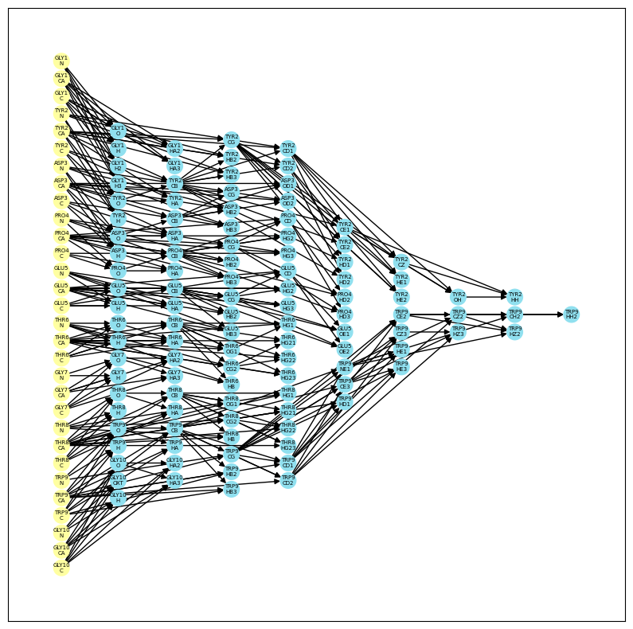

# MCConv




MCConv (Molecular Coordinate Converter) is a versatile tool for interconverting Cartesian and internal coordinates for proteins and biomolecules (to be supported). With MCConv, you can easily develop new conversion schemes and apply them to your projects. MCConv leverages the idea of computing a Directed Acyclic Graph (DAG) that determines the order of computing atomic coordinates. At every stage, local reference frames for atoms are computed using the atomic positions from the previous layer. We currently support jax backend.

## Features
* Convert between Cartesian and internal coordinates for proteins and biomolecules.
* Develop and apply new conversion schemes easily.
* Compute local reference frames for atoms using a DAG which can be used to compute frame-dependent loss functions like FAPE used in AF code.
* Convert multiple structures from a trajectory at once using batch processing.

## Getting Started

### Installation
Currently we are still in the alpha stage, so the relevant code are in the `demo.ipynb` file. The accompanying trajectory file for testing is `chignolin_ensemble.pdb`.

### Usage
Here's an example of how to use MCConv to convert a protein structure from Cartesian to internal coordinates, using the residue gas scheme:

```
import mdtraj

traj = mdtraj.load('chignolin_ensemble.pdb')
top = traj.topology

ict = ICTransformation(top=top, build_frame=build_frame,
                       conversion_scheme=top_to_comp_DAG)
xyz_0 = jnp.array(traj.xyz)
frames, ic = ict.xyz2ic(xyz_0)
frames, xyz = ict.ic2xyz(ic)

```

We will explain the key abstractions in our tool design that allows specifying other conversion schemes. We have implemented the scheme as used in the pNeRF and the Boltzmann Generator papers.

### Dependencies
We will post a yaml file for the minimal conda env shortly. To be succinct, you need to at least have jax, numpy, mdtraj and networkx installed to use MCConv.


## Acknowledgments
This project was inspired by the NeRF algorithm and residue gas representation methods for converting between Cartesian and internal coordinates for proteins and biomolecules. Thank you to the authors of these methods for their contributions to the field. Also thanks to Minhuan for his helpful feedback.

Citations:
```
@article{noe2019boltzmann,
  title={Boltzmann generators: Sampling equilibrium states of many-body systems with deep learning},
  author={No{\'e}, Frank and Olsson, Simon and K{\"o}hler, Jonas and Wu, Hao},
  journal={Science},
  volume={365},
  number={6457},
  pages={eaaw1147},
  year={2019},
  publisher={American Association for the Advancement of Science}
}
```

```
@article{jumper2021highly,
  title={Highly accurate protein structure prediction with AlphaFold},
  author={Jumper, John and Evans, Richard and Pritzel, Alexander and Green, Tim and Figurnov, Michael and Ronneberger, Olaf and Tunyasuvunakool, Kathryn and Bates, Russ and {\v{Z}}{\'\i}dek, Augustin and Potapenko, Anna and others},
  journal={Nature},
  volume={596},
  number={7873},
  pages={583--589},
  year={2021},
  publisher={Nature Publishing Group UK London}
}
```

```
@article{parsons2005practical,
  title={Practical conversion from torsion space to Cartesian space for in silico protein synthesis},
  author={Parsons, Jerod and Holmes, J Bradley and Rojas, J Maurice and Tsai, Jerry and Strauss, Charlie EM},
  journal={Journal of computational chemistry},
  volume={26},
  number={10},
  pages={1063--1068},
  year={2005},
  publisher={Wiley Online Library}
}
```